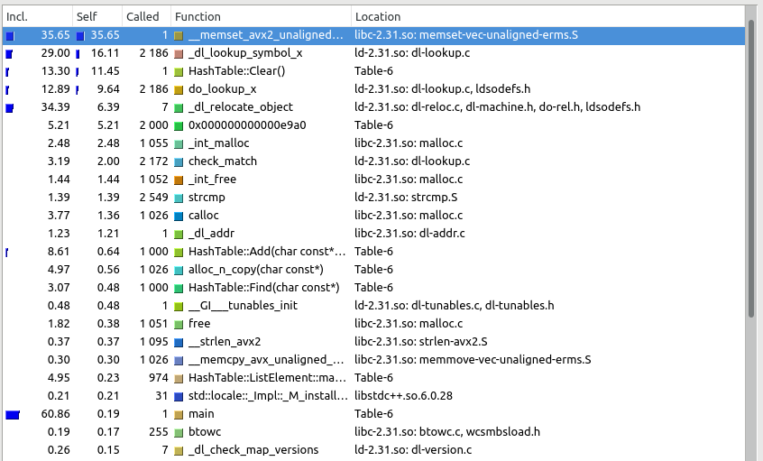

# Оптимизация хеш-таблицы

Данный проект включает в себя написание реализации хеш-таблицы на С++ с разрешением коллизий методом цепочек и её дальнейшую оптимизацию.
## Реализация
Написанная мной хеш-таблица имеет следующий функционал:
  ```cpp
  class HashTable
  {

    struct TableElement;
    struct ChainElement;

  public:

    ~HashTable();
    /*! Выделяет блок динамической памяти block, в который копирует С-строку new_elem, вычисляет хеш-код hash строки key, 
     *  размещает на позиции hash в массиве table[65536] указатель на block. В случае коллизии копирует в динамическую память
     *  key, позиция hash в массиве table становится началом указателя списка. Возвращает 0 в случае успеха, 1 в случае
     *  ошибки аллокации.
     */
    int Add (const char* new_elem, const char* key);

    /*! Вычисляет хеш-код строки key, по хешу ищет значение, соответствующее ключу.
     *  \Return: указатель на найденную строку-значение, nullptr если значение не найдено
     */
    const char* Find (const char* key);

    /*! Импортирует пары ключ-значение из файла filename и добавляет их в таблицу.
     *  Формат импорта:
     *  "key_1": "value_1"
     *  "key_2": "value_2"
     *  ...
     *  
     *  Пример:
     *  Роман Глаз: vokerlee
     *  Андрей Вязовцев: AndreyVV-100
     *  Матвей Крейнин: kreininmv
     *  Георгий Лебедев: CuriousGeorgiy
     * 
     *  \Return: 0 в случае успеха, 1 в случае ошибки
     */
    int RawImport (const char* filename);

    /*! Экспортирует в формат JSON информацию о количестве значений по каждому хешу, рассчитывает и экспортирует также 
     *  дисперсию функции count(hash): количество значений по хешу hash. Пример экспорта - в файле table.json в 
     *  репозитории проекта.
     *  \Return: 0 в случае успеха, 1 в случае ошибки
     */
    int ToJSON (const char* filename, const char* comma);
    
    double CalcDispersion();
    void Clear();
    void Dump(bool fullDump);
    

    ...
  }
  ```
  
  Хеширование осуществляется при помощи несложного, но достаточно эффективного алгоритма полиномиального хеширования:
  ```cpp
    hash_t Polinomial(const char* str)
    {
        const hash_t A = (hash_t)2999;
        hash_t ret = 0;
        int idx = 0;
        while (str[idx])
            ret = A * ret + str[idx++];
        return ret;
    }
 ```
 ## Оптимизация
  ### Способ оптимизации
  
  Чтобы оптимизировать хеш-таблицу, напишем программу-тестировщик хеш-таблицы и при помощи профилирования узнаем, какие функции являются "узкими местами"
  программы, после чего сосредоточим усилия на них.
  Тестирование будет представлять из себя добавление в таблицу 1000 значений по случайным ключам случайной длины от 0 до 50 символов, 
  состоящим из строчных латинских букв, а затем поиск значений по 1000 случайных ключей с такими же параметрами. Программа также будет
  печатать в консоль общее время добавления и поиска.
  
  
  Код тестирующей программы:
  
  ```cpp
  int main()
  {
    HashTable table;
    table.setHashFunc(Polinomial);

    struct timespec begin = { }, end = { };
    
    clock_gettime(CLOCK_PROCESS_CPUTIME_ID, &begin);
    #include "data/add.txt"
    #include "data/find.txt"
    clock_gettime(CLOCK_PROCESS_CPUTIME_ID, &end);

    double time_sec = (end.tv_sec - begin.tv_sec) + 1e-9 * (end.tv_nsec - begin.tv_nsec);
    printf("%g\n", time_sec);
    
  }
  ```
  
Начало файла `data/add.txt`:
```cpp
  table.Add("1", "vmgtbykwqosfbspjhmhpvbh");
  table.Add("1", "iyydrzonluhmtqjkfc");
  table.Add("1", "hugqctxspyyyhxxkpxyejtkvocfyhhpo");
```
Начало файла `data/find.txt`:
```cpp
  table.Find("jldsptekchxlgbrnvxmtifhqjhlfwdxgoby");
  table.Find("udowjmip");
  table.Find("zekxqegvlwfsikpmivbjtfdwtzh");
```
  
  ### Профилирование
Запускаем программу с утилитой callgrind и читаем результат профилировщиком kcachegrind.

По какой-то причине вызванная всего раз `Clear()` выполняется целых 13% времени работы программы. Посмотрим на её реализацию:
```cpp
void Clear()
    {
        TableElement* now = table;
        TableElement* end = table + hashMaxValue;
        for (; now <= end; now++)
        {
            ChainElement* iter = now->next;
            ChainElement* tail = iter;
            while (iter)
            {
                iter = iter->next;
                delete tail;
                tail = iter;
            }

            free((void*)now->value);
            now->value = nullptr;
            now->next = nullptr;
            now->chainLength = 0;
        }
    }
 ```
 Вероятно, функция работает медленно из-за неоптимального её поведения на пустых ячейках table, которых достаточно много: в нашем случае около 64536 из 65536.
 Поэтому можно попробовать вставить строчку 'if ( !now->isValueDefined()) continue;'. В случае малого заполнения таблицы она призвана спасти нас от ~65000
 ненужных итераций, а в случае большого заполнения её вклад во время исполнения программы будет незначителен. Запускаем 2-ю версию программы и сравниваем 
 время исполнения:
 #### 1-я версия: `0.000903918 s`
 #### 2-я версия: `0.000899570 s`
 По времени исполнения программы практически идентичны. Посмотрим на результат профилирования второй версии:
 
 `Clear()` стала исполняться быстрее, значит, *произошло ускорение*.
 Обратим внимание, что `free()` исполняется чуть более 65536 раз. Это происходит в деструкторе ListElement, от которого наследуются ChainElement и TableElement,
 а также в деструкторе ChainElement, котоый, однако, вызывается не очень часто:
 ```cpp
 ~ListElement()
{
     free ((void*)value);
}
 ~ChainElement()
{
     free((void*)key);
}
```
Деструкторы `ListElement` и `TableElement` вызываются после деструктора `HashTable`, вызывающего `Clear()`. `Clear()` полностью удаляет все `TableElement`
и вызывает деструкторы для всех `ChainElement`. Поэтому имеет смысл перенести содержимое `~ListElement()` в `~ChainElement()`, а сам `~ListElement()` удалить.
 #### 2-я версия: `0.001060250 s`
 #### 3-я версия: `0.000858562 s`
Программа немного ускорилась, в чём можно убедиться, посмотрев на профилирование 3-й версии:

Функции
```cpp
bool isValueDefined() { return this->value; }
```
и заодно
```cpp
bool isNextDefined()  { return this->next; }
```
и
```cpp
bool isKeyDefined() { return this->key; }
```
вызываются в `Clear()` много раз, и расходы на их вызов не стоят уровня абстракции над полями `ListElement`. Поэтому удалим эти функции и заменим обращения к
ним на явные обращения к полям.
4-я версия:

Обратим внимание на частые вызовы конструкторов `ListElement` и `TableElement`.
```cpp
ListElement():
  value(nullptr),
  next(nullptr)
{}
```
```cpp
TableElement():
  ListElement(),
  chainLength(0),
  tail(nullptr)
{}
```
Так как они просто зануляют поля элементов массива `table`, можно, попробовать удалить эти конструкторы, перенеся содержимое `ListElement()` явно в 
`ChainElement()`, и использовать `memset(table, 0, (hashMaxValue + 1)*sizeof(*table))` вместо них.
Однако, как оказывается, `memset` исполняется даже дольше:

Поэтому откажемся от этой идеи.
Значительную часть времени исполнения программы составляет `Polimomial` - функция подсчёта хеша:
```cpp
    hash_t Polinomial(const char* str)
    {
        const hash_t A = (hash_t)2999;
        hash_t ret = 0;
        int idx = 0;
        while (str[idx])
            ret = A * ret + str[idx++];
        return ret;
    }
```
Её можно оптимизировать двумя способами:
- Использовать SSE-инструкции:
```cpp
unsigned short PolinomialSSE (const char* str)
    {
        if (sizeof(hash_t) != sizeof(unsigned short))
        {
            printf("Не буду считать\n");
            return 0xDEAD;
        }

        unsigned short ret = *(str++), new_ret = 0;

        if (ret == 0) return ret;

        const __m128i factor = _mm_set_epi16(
            1,
            2999,
            15569,
            29799,
            41633,
            11287,
            33137,
            25287
        );
        // Числа - short-степени 3189. Любое из этих чисел, что существенно, равно 0 при
        // short-умножении на char, если и только если char == '\0'.

        union
        {   __m128i pack;
            unsigned short arr [8];
        } sample, mult; 


        while (true)
        {
            
            sample.pack = _mm_set_epi16(str[6], str[5], str[4], str[3], str[2], str[1], str[0], ret);
            mult.pack = _mm_mullo_epi16(sample.pack, factor);

            new_ret = mult.arr[0];

            #define STEP(i)                                                              \
                new_ret += mult.arr[i];                                                  \
                if (mult.arr[i] == 0)                                                    \
                {                                                                        \
                    sample.pack = _mm_bslli_si128(sample.pack, 16 - 2*i);                \
                    mult.pack = _mm_mullo_epi16(sample.pack, factor);                    \
                    ret = 0;                                                             \
                    for (int j = 8 - i; j < 8; j++)                                      \
                        ret += mult.arr[j];                                              \
                    return ret;                                                          \
                }

            STEP(1)
            STEP(2)
            STEP(3)
            STEP(4)
            STEP(5)
            STEP(6)
            STEP(7)

            ret = new_ret;
            str += 7;
        }

        printf("Why am I here?\n");
        return 0xDEAD;
    }
```
- переписать на ассемблере:
```
global Polinomial_asm

Polinomial_asm:

    mov si, 3189
    xor rax, rax
    xor rcx, rcx
    mov cl, [rdi]
    jrcxz Return

    Repeat:
        add ax, cx
        inc rdi
        mov cl, [rdi]
        jrcxz Return
        mul si
        jmp Repeat
    Return:
        ret
```
Протестируем программу с SSE
  
и c ассемблерной функциями.

Ассемблерная оптимизация оказалась удачной, поэтому заменим `Polinomial` на `Polinomial_asm`.
Сравним скорости исполнения:
 #### 4-я версия: `0.000898323 s`
 #### 5-я версия: `0.000431959 s`
 Ускорение приблизительно в 2 раза.
 В профилировании 5-й версии всё ещё занимает много места `TableElement::TableElement()`. Попытка оптимизации с помощью вызова `memset` успехом не увенчалась - попробуем инициализировать массив `table` класса `HashTable` другим способом: вместо
 ```cpp
 TableElement table[hashMaxValue + 1];
 ```
 напишем
 ```cpp
 char buffer_[(hashMaxValue + 1)*sizeof(TableElement)] = { };
 TableElement* const table = (TableElement*)buffer_;
  ```
 и таким образом избежим 65536 вызовов `TableElement::TableElement()`. По профилированию новой, 6-й версии
 
 видно, что программа немного ускорилась, проверим это:
 #### 5-я версия: `0.000535373 s`
 #### 6-я версия: `0.000507130 s`
 Можно ещё 
 
